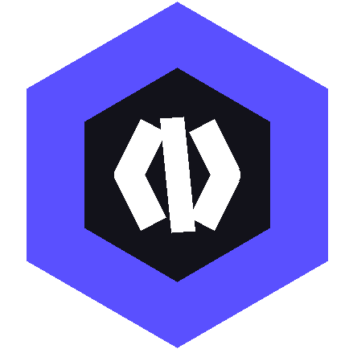

# Hexode - AI-Powered Cloud-Based Collaborative IDE 



**Hexode** is a modern, AI-powered cloud-based collaborative IDE that enables real-time code editing, execution, and collaboration. Built with React, Monaco Editor, and Yjs for seamless real-time synchronization.

**LIVE DEMO**: [Hexode](https://hexode.vercel.app)

---

## ✨ Features

### 🚀 Core Features

- **Multi-Language Support**: JavaScript, Python, Java, C, C++
- **Real-Time Collaboration**: Live code editing with Yjs
- **Cloud Persistence**: MongoDB-backed project storage
- **Code Execution**: Instant code running via Piston API
- **File Management**: Create, edit, delete files and folders

### 🤖 HexodeAI

- **Context-Aware Assistance**: Chat with your codebase using Google Gemini.
- **Smart Generation**: Insert generated code directly at your cursor.
- **Debugging & Refactoring**: One-click explanations and fixes.
- **Code Explanation**: Highlight code to get instant insights.

### 💬 Collaboration & Security

- **Real-Time Chat**: Communicate with collaborators.
- **Guest Access Control**: Toggle "Guest Edit" permissions on the fly.
- **Live Cursors & Presence**: See who is online in real-time.
- **Secure Sharing**: Default private projects with opt-in public access.

### 🎨 User Experience

- **Interactive Product Tour**: 8-step onboarding for new users
- **Keyboard Shortcuts**: Ctrl+S to save, Ctrl+Enter to run
- **Auto-Save**: Debounced auto-save every 2 seconds
- **Loading States**: Skeleton loaders and spinners
- **Toast Notifications**: User-friendly feedback
- **Dark/Light Theme**: Toggle between themes

### 🔒 Security & Performance

- **CORS Protection**: Strict origin validation
- **Input Validation**: Server-side validation on all endpoints
- **Rate Limiting**: DDoS protection (100 req/15min)
- **Error Boundaries**: Graceful error handling
- **File Limits**: Max 50 files, 1MB per file
- **Bundle Optimization**: Code splitting ready

### ♿ Accessibility

- **ARIA Labels**: Screen reader support
- **Keyboard Navigation**: Full keyboard accessibility
- **Focus Indicators**: Clear focus states

---

## 🏗️ Tech Stack

### Frontend

- **React** + **Vite**: Fast development and builds
- **Monaco Editor**: VS Code's editor
- **Yjs** + **y-websocket**: Real-time collaboration
- **Framer Motion**: Smooth animations
- **Clerk**: Authentication
- **Tailwind CSS**: Styling
- **Lucide Icons**: Beautiful icons

### Backend

- **Node.js** + **Express**: Server framework
- **MongoDB** + **Mongoose**: Database
- **Yjs** + **y-leveldb**: CRDT persistence
- **WebSocket**: Real-time communication
- **Piston API**: Code execution

---

## 📦 Installation

### Prerequisites

- Node.js 18+
- MongoDB
- npm or yarn

### Clone Repository

```bash
git clone https://github.com/yourusername/hexode.git
cd hexode
```

### Install Dependencies

```bash
# Install server dependencies
cd server
npm install

# Install client dependencies
cd ../client
npm install
```

### Environment Variables

**Server** (`server/.env`):

```env
MONGO_URI=mongodb://localhost:27017/hexode
PORT=3001
CLIENT_URL=http://localhost:5173
NODE_ENV=development
GEMINI_API_KEY=your_gemini_api_key
```

**Client** (`client/.env`):

```env
VITE_API_URL=http://localhost:3001
VITE_CLERK_PUBLISHABLE_KEY=your_clerk_key
# VITE_WS_URL=ws://... (Optional: Auto-derived from API_URL)
VITE_GA_MEASUREMENT_ID=G-XXXXXXXXXX  # Optional
```

### Run Development Servers

**Terminal 1 - Server:**

```bash
cd server
npm run dev
```

**Terminal 2 - Client:**

```bash
cd client
npm run dev
```

Visit: `http://localhost:5173`

---

## 🚀 Production Build

### Client

```bash
cd client
npm run build
npm run preview  # Test production build
```

### Server

```bash
cd server
npm start
```

---

## 📁 Project Structure

```
hexode/
├── client/                 # React frontend
│   ├── src/
│   │   ├── components/    # Reusable components
│   │   ├── pages/         # Page components
│   │   ├── utils/         # Utilities (analytics, etc.)
│   │   └── context/       # React contexts
│   └── public/            # Static assets
├── server/                # Node.js backend
│   ├── models/           # MongoDB models
│   ├── storage/          # Yjs LevelDB storage
│   └── index.js          # Server entry point
└── README.md
```

---

## 🎯 Key Features Implementation

### Real-Time Collaboration (Yjs)

```javascript
// Automatic synchronization across clients
const ydoc = new Y.Doc();
const provider = new WebsocketProvider("ws://localhost:3001", roomId, ydoc);
```

### Auto-Save

```javascript
// Debounced auto-save every 2 seconds
useEffect(() => {
  const handleUpdate = () => {
    if (saveTimeoutRef.current) clearTimeout(saveTimeoutRef.current);
    saveTimeoutRef.current = setTimeout(performSave, 2000);
  };
  ydoc.on("update", handleUpdate);
}, []);
```

### Keyboard Shortcuts

- **Ctrl+S** / **Cmd+S**: Manual save
- **Ctrl+Enter** / **Cmd+Enter**: Run code

---

## 📊 Analytics (Optional)

Add Google Analytics 4 tracking:

1. Get GA4 Measurement ID
2. Add to `client/.env`: `VITE_GA_MEASUREMENT_ID=G-XXXXXXXXXX`
3. Events tracked: project creation, code execution, file operations

---

## 🔐 Security Features

- **CORS**: Whitelist-based origin validation
- **Rate Limiting**:
  - API: 100 requests/15min
  - Projects: 5 creations/min
  - Execution: 15 runs/min
- **Input Validation**: All API endpoints validated
- **Error Boundaries**: Prevent app crashes

---

## 🎨 Customization

### Themes

Toggle between dark/light themes via the theme toggle button.

### Languages

Supported: JavaScript, Python, Java, C, C++

Add more in `IDE.jsx`:

```javascript
const RUNTIMES = {
  javascript: "18.15.0",
  python: "3.10.0",
  // Add more...
};
```

---

## 🐛 Troubleshooting

### Port Already in Use

```bash
# Kill process on port 3001 (server)
npx kill-port 3001

# Kill process on port 5173 (client)
npx kill-port 5173
```

### MongoDB Connection Failed

- Ensure MongoDB is running: `mongod`
- Check `MONGO_URI` in `server/.env`

### Yjs Sync Issues

- Clear browser localStorage
- Restart server to reset LevelDB

---

## 🤝 Contributing

1. Fork the repository
2. Create feature branch: `git checkout -b feature/amazing-feature`
3. Commit changes: `git commit -m 'Add amazing feature'`
4. Push to branch: `git push origin feature/amazing-feature`
5. Open Pull Request

---

## 📝 License

MIT License - see LICENSE file for details

---

## 🙏 Acknowledgments

- **Monaco Editor** - VS Code's editor
- **Yjs** - CRDT framework
- **Piston** - Code execution engine
- **Clerk** - Authentication
- **Tailwind CSS** - Styling framework

---

## 📧 Contact

- **Website**: [souravpaitandy.me](https://www.souravpaitandy.me)
- **GitHub**: [@souravpaitandy](https://github.com/souravpaitandy)
- **Email**: souravpaitandy@gmail.com

---

**Built with ❤️ by Sourav Paitandy**
